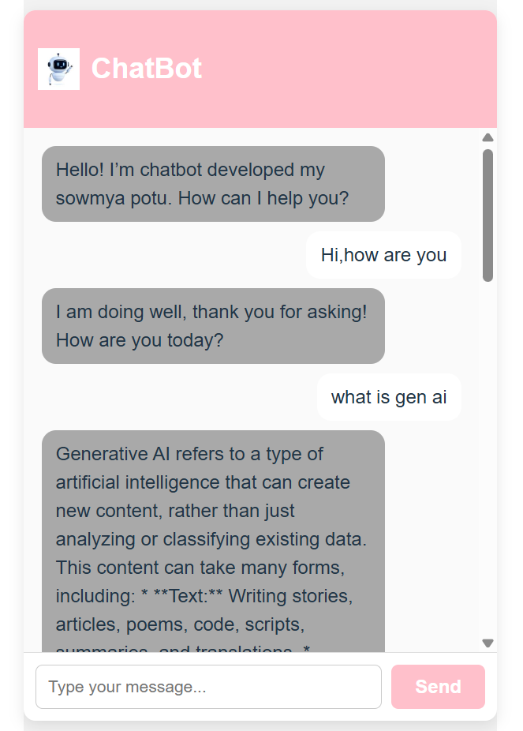

# React + Vite

# tech stack used in this 
React — Frontend UI library for building interactive user interfaces

Vite — Fast build tool and development server for React apps

JavaScript (ES6+) — Programming language used for React components and logic

CSS — Styling the chatbot UI (plain CSS, no frameworks)

Google Gemini API — AI generative language model API powering the chatbot responses

React Icons (optional) — For including chatbot icon or other UI icons

Environment Variables — .env file used to securely manage API keys with Vite’s VITE_ prefix

Node.js & npm — For package management and running the dev server
# React Gemini Chatbot

A simple React chatbot UI that connects to **Google Gemini API** for AI-powered conversations.

---

## Features

- Clean, centered chat card UI with user and bot message bubbles
- Connects to Google Gemini API (using your API key)
- Sends user input and displays AI-generated responses
- Loading indicator while waiting for AI reply
- Responsive and minimal design using plain CSS (no Tailwind)

---

## Setup & Usage

### 1. Clone the repo

```bash
git clone https://github.com/your-username/react-gemini-chatbot.git
cd react-gemini-chatbot

